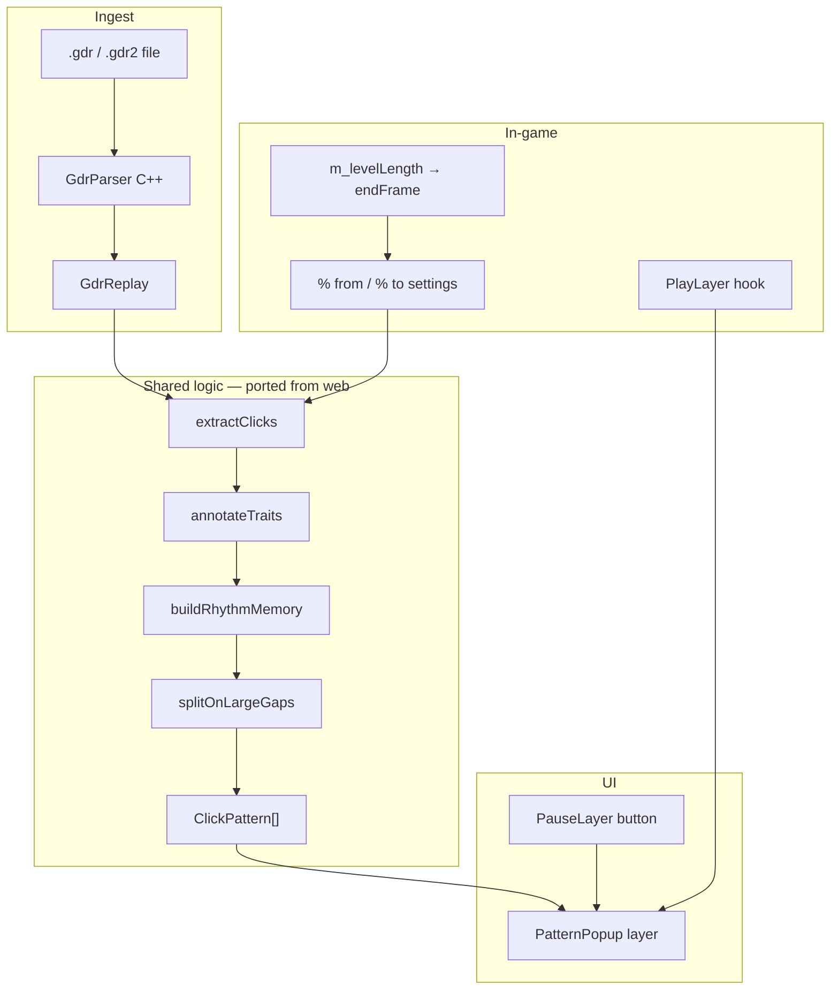

# GDR Pattern Reader — Geode Mod Concept

## Vision

Bring the **web GDR Pattern Reader** into Geometry Dash as a Geode mod: load a macro replay (`.gdr` / `.gdr2`), pick a level section by **in-game %**, and see the same **numbered rhythm patterns** (e.g. `1 · 123 · 123`, late `′`, long hold `‾`) while you play or practice.

The web app stays untouched in `gdr-click-pattern/`. This mod lives in **`gdr-pattern-geode/`** and shares **logic**, not code — the analysis rules are ported to C++ to match the TypeScript implementation.

---

## Why a mod?

| Web app | Geode mod |
|--------|-----------|
| Upload replay file | Open from macro folder / file picker |
| Guess level length from replay header | Use **real** `PlayLayer` level length → correct % |
| Practice in browser with keyboard | Future: practice overlay on real jump input |
| IndexedDB library | Save patterns per level ID in mod save |

---

## Architecture



---

## Phased roadmap

### Phase 1 — MVP (this repo)

- [x] C++ port of `analyzeSection` + `rhythmMemory` (same constants as web)
- [x] GDR2 binary parser (MegaHack `.gdr2`)
- [x] GDR1: detect + friendly error (MessagePack → optional later via `msgpack-c`)
- [x] **Pause menu** → “Pattern” opens popup with mnemonic, trait line, click table (% only)
- [x] **Mod settings**: % from, % to, player filter (P1/P2/auto)
- [x] **Load replay** button on main menu → file picker, cache in mod save
- [x] Level % uses `PlayLayer::m_levelLength` when in a level; else replay duration

### Phase 2 — In-level overlay

- Small HUD during play: current pattern chunk + next tap number
- Highlight when player is late (compare live frame to expected press)
- Section timeline scrubber (simplified) on pause screen

### Phase 3 — Practice mode

- Port `gradePractice` timing windows (35/70/140 ms)
- Listen to jump input via Geode input API
- Optional burst-only practice (`slicePatternForBurst`)

### Phase 4 — Integrations

- **xdBot / MegaHack**: read active macro without re-importing file
- **Share codes**: export pattern mnemonic as clipboard string
- **Sync with web**: export JSON pattern bundle from mod, import in browser library

---

## Data mapping (web → mod)

| TypeScript | C++ |
|------------|-----|
| `GdrInput` | `gdr::Input` |
| `GdrReplay` | `gdr::Replay` |
| `AnalyzedClick` | `analysis::Click` |
| `ClickPattern` | `analysis::Pattern` |
| `analyzeSection()` | `analysis::analyzeSection()` |
| `frameToPercent()` | `util::frameToPercent()` |

---

## UI flows

### A. Load macro (main menu)

1. Player taps **GDR Pattern** on bottom menu (or Geode mod settings).
2. File picker → `.gdr` / `.gdr2`.
3. Parsed replay stored in `Mod::get()->saveData()`.

### B. Analyze section (pause)

1. Player pauses in a level (or from level select with loaded macro).
2. **Pattern** → compute `fromFrame` / `toFrame` from settings % × `levelLength`.
3. Popup shows:
   - Pattern label + description
   - **Count:** `1 · 123 · 123`
   - **Detail:** `1·2′·3‾`
   - Table: `#` | `Level %` | `Note`

### C. Settings (Geode mod settings UI)

- `percent-from` (0–100)
- `percent-to` (0–100)
- `player-filter` (P1 / P2 / auto)
- `last-replay-path` (internal)

---

## Technical notes

- **Geode SDK** required (`GEODE_SDK` env, `geode build`).
- Target GD **2.2081** (see `mod.json`).
- No React, no IndexedDB — use Geode `saveData` JSON or `ModSaveData`.
- **Threading**: parse large replays on `geode::utils::thread` pool (Phase 2); MVP parses on menu load synchronously with loading toast.
- **Legal**: mod only reads user-provided replay files; does not automate gameplay.

---

## Folder layout

```
gdr-pattern-geode/
  CONCEPT.md          ← this file
  README.md           ← build & install
  mod.json
  CMakeLists.txt
  about.md
  src/
    main.cpp
    analysis/         ← ported from src/analysis/
    gdr/              ← ported from src/gdr/ (GDR2)
    util/
    ui/
    hooks/
```

---

## Success criteria for MVP

1. Build produces `.geode` package without touching web project.
2. Loading a `.gdr2` from the user’s macro and opening pause → **Pattern** shows the same mnemonic as the web app for the same frame range (given matching % bounds and level length calibration on web).
